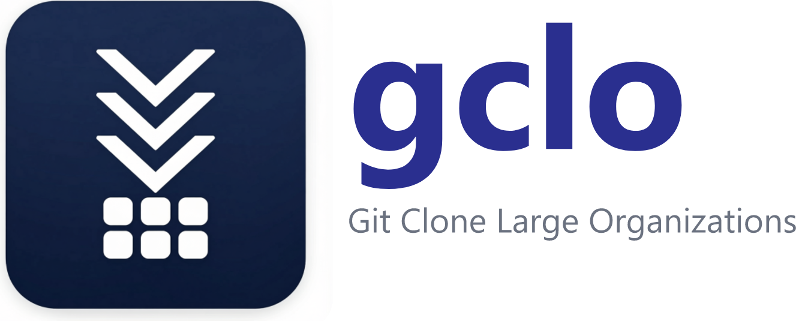

<p align="center">
  
</p>

<p align="center"><b>Clone an entire GitHub organization. Keep it up to date. In parallel.</b></p>

<p align="center">
  <a href="LICENSE"></a>
  <a href="https://github.com/KofTwentyTwo/gclo"></a>
  <a href="https://dotnet.microsoft.com/"></a>
</p>

**gclo** (**G**it **C**lone **L**arge **O**rganizations) mirrors every repository of a GitHub organization or user account into a local folder in one pass: it clones the repositories that are missing and fast-forwards the ones that already exist, with live per-repo progress and bounded parallelism. It ships as a Windows 11 desktop app (WinUI 3) and a scriptable CLI built on the same engine.

<!-- SCREENSHOT (hero): main window mid-sync — token and org filled in, overall progress bar partway,
     per-repo list showing a mix of Cloning (with %), Pulling, and Done. Tracked in issue #10. -->

## Download & install

All builds are published on the [**GitHub Releases** page](https://github.com/KofTwentyTwo/gclo/releases).

**Desktop app (GUI)** — download and run `gclo-stable-Setup.exe`. It installs per-user (no admin rights needed) and updates itself in-app via **Help > Check for updates**. A portable build (`gclo-stable-Portable.zip`) is also attached to each release; portable builds do not self-update.

**CLI** — download `gclo-cli-win-x64.zip` and unzip it anywhere. It is a self-contained single `gclo.exe` — no .NET runtime required.

Plain version tags (`v1.2.3`) are **stable** releases; pre-release tags (`v1.2.3-beta.1`) publish to the **dev** channel, and an installed app only ever updates within its own channel.

Installation via `winget` is coming soon.

## Getting a token

gclo authenticates to GitHub with a personal access token — it is used for both the API (listing repositories) and the git transport (cloning and fetching). Create one under [GitHub Settings > Developer settings > Personal access tokens](https://github.com/settings/tokens).

| Token type | What you need |
| --- | --- |
| Classic PAT | `repo` scope (read access to the org's repositories); optionally `read:org` so the organization dropdown / `gclo orgs` can list your orgs |
| Fine-grained PAT | Repository read access for the organization |

The token is used in memory for the duration of a sync and is never stored on disk.

## Using the GUI

<!-- SCREENSHOT: empty main window on first launch — token box, org dropdown, target folder
     with subfolder checkbox and path preview, Parallel spinner, Load repos / Sync selected
     buttons. Tracked in issue #10. -->

1. **Paste your token first.** After a moment, the **Organization or account** dropdown fills with everything the token can sync — your personal account is listed first, then your organizations alphabetically. If the token cannot list organizations (a fine-grained PAT, or a classic PAT without `read:org`), the status line says so; the dropdown is editable, so just type the name.
2. **Pick the organization or account** from the dropdown.

   <!-- SCREENSHOT: org dropdown open, personal account at the top followed by orgs. Tracked in issue #10. -->

3. **Choose a target folder** — type a path or click **Browse...**. Tick **Create a `<org>` subfolder** to keep several organizations under one root; the live preview line underneath always shows exactly where repositories will land (e.g. `C:\src\acme\my-repo`).
4. **Set parallelism** if you like (1–64, default 8): how many git operations run at once.
5. **Press Load repos.** The table fills with every repository of the organization — name, status, default branch, and an Archived marker — all selected. Click a column header to sort by it; click it again to flip the direction.
6. **Uncheck anything you don't want.** The header checkbox selects or clears every row at once.
7. **Press Sync selected.** Each row moves through its states live — Queued, Cloning (with a per-row progress bar and transfer percentage), Pulling, Done, Failed, or Canceled — while the overall progress bar and completed/total counter track the run, which ends in a summary (`Finished: 3 cloned, 41 updated, 1 failed, 0 canceled of 45.`).

   <!-- SCREENSHOT: sync in progress — several rows Cloning with per-row progress bars, overall bar advancing. Tracked in issue #10. -->

8. **Cancel** at any time: in-flight repos stop cleanly, unstarted repos are marked Canceled, and the summary still appears. After a run, **Retry failed** re-runs exactly the failed rows, and **Open folder** opens the target folder in Explorer.

**When something goes wrong:** failures are isolated per repository — one broken repo never stops the rest, and a failed row shows its error message inline. Most failed clones are cleaned up, so a partial checkout is never mistaken for a valid repo on the next run. Repositories with Windows-impossible paths are the deliberate exception: gclo checks every path in the incoming tree against Windows file-system rules *before* checkout — invalid characters, reserved device names like `CON`, trailing spaces or dots, names that differ only by case — and when it finds any, the repo is marked Failed with a per-path list of reasons, but the fully fetched `.git` is **kept** (nothing was ever checked out). Recovery happens in place, with no re-download: click the row's **Resolve…** link to rename each offending path (safe names are pre-suggested) or skip it, and gclo materializes the working tree right there; the CLI does the same automatically with [`--sanitize-paths`](docs/CLI.md#windows-invalid-paths-and---sanitize-paths). Long paths beyond the classic 260-character limit are handled automatically (`core.longpaths`).

**Settings** (File > Settings…) let you set the default target folder, the default parallelism, and the theme (System, Light, or Dark).

<!-- SCREENSHOT: Settings dialog — default target folder, default parallelism, theme. Tracked in issue #10. -->

**Activity log:** View > Activity log… shows the tail of today's log and links to the logs folder. Logs live under `%LOCALAPPDATA%\gclo\logs`, one file per day; they record run parameters and per-repo failures and never contain your token (see [SECURITY.md](SECURITY.md)).

**Updates:** Help > Check for updates… downloads and applies the latest release for your channel. Self-update is only available in installed builds (not the portable zip or a local debug build).

## Using the CLI

The CLI drives the same engine from scripts and scheduled jobs. There is deliberately no `--token <value>` option — command-line arguments leak to other processes — so the token comes from the `GITHUB_TOKEN` environment variable by default, or from `--token-env`, `--token-file`, or `--token-stdin`.

PowerShell:

```powershell
# List everything the token can sync (your account first, then orgs)
$env:GITHUB_TOKEN = (Get-Secret -Name GitHubPat -AsPlainText)
gclo orgs

# Mirror an organization, 16 git operations at a time
gclo sync --org contoso --target C:\src\contoso --parallel 16

# Pipe the token from a secret store — it never touches a command line or disk
gh auth token | gclo sync --org contoso --target C:\src\contoso --token-stdin

# Machine-readable result
$result = gclo sync --org contoso --target C:\src\contoso --json | ConvertFrom-Json
if ($result.failed -gt 0) { $result.failures | ForEach-Object { "$($_.repo): $($_.error)" } }
```

bash:

```bash
# List orgs, then mirror one
export GITHUB_TOKEN="$(pass show github/pat)"
gclo orgs
gclo sync --org contoso --target ~/src/contoso

# Pipe the token from a secret store
op read "op://Private/GitHub PAT/token" | gclo sync --org contoso --target ~/src/contoso --token-stdin

# Machine-readable result with jq
gclo sync --org contoso --target ~/src/contoso --json |
  jq -r '.failures[] | "\(.repo): \(.error)"'
```

`--org` accepts an organization or a user account login. `--json` suppresses progress output and prints a single JSON summary line; combined with the exit code it makes gclo easy to wire into cron/scheduled tasks:

| Exit code | Meaning |
| --- | --- |
| 0 | Everything succeeded. |
| 1 | The run completed, but some repositories failed or the run was canceled (Ctrl+C). |
| 2 | Fatal: bad arguments, missing/empty/rejected token, or organization not found. |

Full reference — all options, output streams, Ctrl+C behavior, and more examples: [docs/CLI.md](docs/CLI.md).

## How it works

The engine lists every repository through the GitHub REST API (Octokit, paginated 100 per page), then runs the set through `Parallel.ForEachAsync` bounded by the parallelism setting. Git operations use LibGit2Sharp: missing repos are cloned with object-transfer progress; existing repos get a fetch from `origin` followed by a **fast-forward-only** merge — if a local branch has diverged from its upstream, the repo is reported Failed rather than auto-merged, so gclo never manufactures merge commits. Archived repositories are included and sync normally. Every repo ends in exactly one terminal state — Done, Failed (with the error), or Canceled — and per-repo exceptions are contained so the rest of the run continues. The PAT is the only credential; on the git side it is sent as HTTPS basic credentials with username `x-access-token`.

## Build from source

Requirements: Windows 11 (or Windows 10 1809+), the [.NET 10 SDK](https://dotnet.microsoft.com/), and — for the desktop app — Visual Studio 2026 with the Windows App SDK / WinUI workload.

```powershell
git clone https://github.com/KofTwentyTwo/gclo.git
cd gclo

# Desktop app (packaged build)
dotnet build gclo.slnx -p:Platform=x64

# Desktop app, unpackaged — a plain exe under gclo\bin\x64\Debug\, no MSIX deployment
dotnet build gclo.slnx -p:Platform=x64 -p:WindowsPackageType=None

# CLI only (plain net10.0 — also builds on Linux/macOS)
dotnet run --project gclo.Cli -- sync --org contoso --target C:\src\contoso

# Tests
dotnet test
```

To F5-debug the packaged app in Visual Studio, open `gclo.slnx`, set `gclo` as the startup project, select the `x64` platform, and make sure Windows **Developer Mode** is enabled (Settings > System > For developers) — packaged deployment requires it.

## Project layout

| Project | Description |
| --- | --- |
| `gclo` | WinUI 3 packaged desktop app — XAML, dialogs, pickers, and update plumbing only; no business logic |
| `gclo.Cli` | Cross-platform command-line head over the engine ([docs/CLI.md](docs/CLI.md)) |
| `gclo.Engine` | Core sync engine: `OrgSyncEngine`, Octokit-based listers, LibGit2Sharp git client, Windows path validation |
| `gclo.ViewModels` | UI-framework-free view models and settings persistence, shared presentation logic |
| `gclo.Engine.Tests` | xunit tests: engine (with fakes), real-git integration suite, and view-model tests |

## Contributing

Contributions are welcome. Development happens on the `dev` branch; `main` is the stable branch and only advances via pull requests with passing status checks — so base your PRs on `dev`. See [CONTRIBUTING.md](CONTRIBUTING.md) for prerequisites, build and test commands, and pull request expectations (zero-warning builds, green tests, unpackaged mode kept working).

## License

gclo is licensed under the [MIT License](LICENSE). Copyright (c) 2026 James Maes.

gclo builds on the following open-source projects:

| Dependency | License |
| --- | --- |
| [Octokit](https://github.com/octokit/octokit.net) | MIT |
| [LibGit2Sharp](https://github.com/libgit2/libgit2sharp) | MIT |
| [libgit2](https://github.com/libgit2/libgit2) (native library used by LibGit2Sharp) | GPLv2 with linking exception |
| [CommunityToolkit.Mvvm](https://github.com/CommunityToolkit/dotnet) | MIT |
| [Windows App SDK](https://github.com/microsoft/WindowsAppSDK) | MIT |
| [Velopack](https://github.com/velopack/velopack) (self-update) | MIT |
