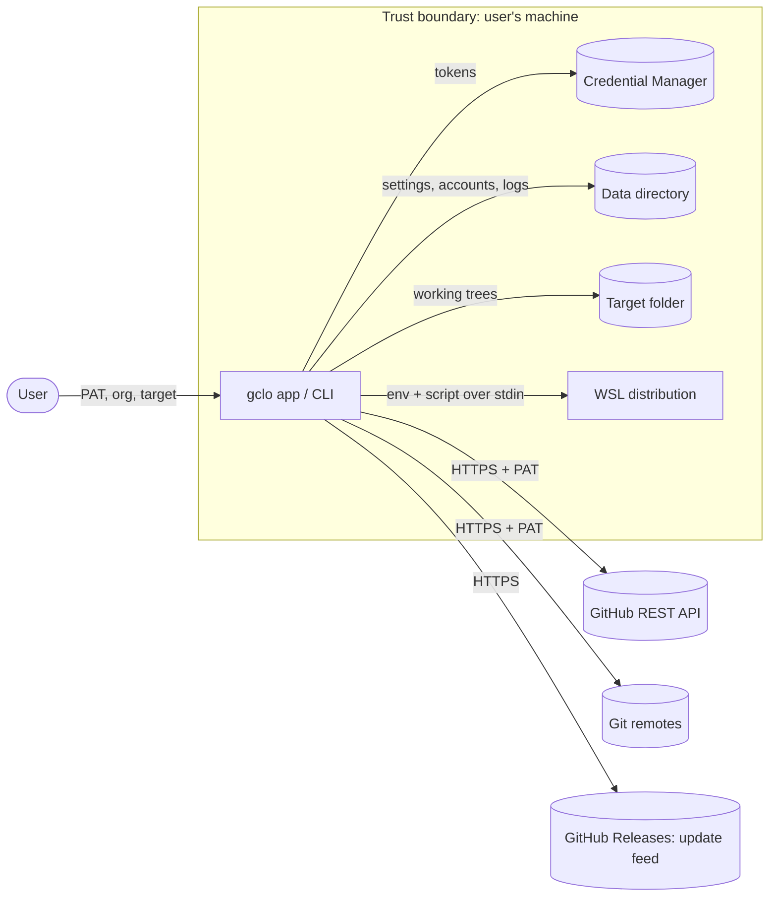

# Threat model: gclo

<!-- K22-SDLC-03. Update in any pull request that changes the attack surface, and
     review it in every MINOR/MAJOR release checklist (K22-SEC-30).
     Method: data-flow diagram + STRIDE per trust boundary. -->

- **Version reviewed:** v1.0.1 · **Last reviewed:** 2026-10-09

## 1. What the product is and does

gclo (Git Clone Large Organizations) is a Windows 11 desktop app (WinUI 3) and a
command-line tool that mirror every repository of a GitHub organization or user
account into a local folder: it lists repositories through the GitHub REST API, then
clones the missing ones and fast-forwards the existing ones over HTTPS with a
personal access token (PAT) the user supplies. It runs as the user, with the user's
privileges, on the user's machine, and has access to that PAT, the target folder, and
(for the WSL recovery) the default WSL distribution. It sends nothing anywhere except
GitHub.

## 2. Actors and components

| Actor or component | Description | Trust level |
| --- | --- | --- |
| User | Runs the app or CLI with their own PAT and chooses the target folder | Trusted for their own data |
| gclo app / CLI | `gclo.exe` (WinUI 3) and the CLI `gclo.exe`, same engine | Trusted; runs as the user |
| GitHub REST API | Lists organizations and repositories | Untrusted input (responses are parsed), authenticated by the PAT |
| Git remotes (`github.com`) | Clone and fetch over HTTPS via libgit2 | Untrusted input (repository content, including file paths) |
| Windows Credential Manager | Stores saved-account and default tokens | Trusted store; boundary is the Windows user account |
| Local data directory | `%LOCALAPPDATA%\KofTwentyTwo\gclo` (or `GCLO_DATA_DIR`): settings, accounts, logs. Deliberately outside the Velopack install root `%LOCALAPPDATA%\gclo`, which Setup.exe deletes on reinstall (#91) | Trusted; same user |
| Target folder | Where repositories are written; may already contain repositories | Partly untrusted (pre-existing content, `.git` config) |
| WSL default distribution | Runs `git clone` for the "Clone in WSL" recovery | Semi-trusted (user-installed Linux environment) |
| Update feed | GitHub Releases of this repository, `releases.<channel>.json` | Untrusted until verified (HTTPS, package hashes, attestations) |
| Package managers | Scoop bucket (this repo), Chocolatey, winget | Untrusted transport; assets verified by hash |

## 3. Data flow and trust boundaries

## 4. External interfaces

| Interface | Direction | Data | Authenticated? | Validated where? |
| --- | --- | --- | --- | --- |
| GitHub REST API (Octokit) | out/in | Organization and repository metadata | PAT (bearer) | `GitHubRepositoryLister` / `GitHubOrganizationLister`: typed responses; names deduplicated; `RepositoryPathResolver` contains every target path under the target root |
| Git HTTPS transport (libgit2) | out/in | Repository objects and trees | PAT as HTTPS basic (`x-access-token`) | `WindowsPathValidator` checks every incoming path against Windows rules before checkout; non-fast-forward is reported, never merged |
| PAT entry | in | The token | n/a | App: in-memory or Credential Manager; CLI: env var, file, or stdin only (no `--token <value>`) |
| Credential Manager | out/in | Tokens by `gclo[:<scope>]:account:<id>` target | Windows user session | `CredentialManagerVault`; scope derived from the data root |
| `settings.json`, `accounts.json` | out/in | Non-secret settings and account metadata | File ACL (user profile) | Atomic writes, sanitized on load, corrupt files preserved as `.bak` |
| Activity logs | out | Actions and errors; token *lengths* only | File ACL | `IActivityLog` callers never pass tokens |
| `.git/gclo-recovery.json`, `gclo.checkoutpending` config key | out/in | Path-recovery plan; checkout-pending marker | File ACL | Written atomically; read only for the repository it belongs to |
| Command line (CLI) | in | Options, org, target, filters | n/a | `OptionReader` / `RepoFilterSpec`; parallelism bounded 1..64; token options refused on argv |
| `GCLO_DATA_DIR`, `GCLO_UITEST_FIXTURE` env | in | Data root override; offline test seam | n/a | Fixture only answers for the exact fixture token; never set in production |
| `wsl.exe -e sh -s` | out/in | POSIX script on stdin, org/repo/url as positional args, `GCLO_GIT_TOKEN` via `WSLENV` | PAT via env | Nothing is re-parsed by wsl.exe's command line; token never on argv or disk; UTF-16 wsl.exe messages decoded |
| Update feed (Velopack) | in | `releases.<channel>.json`, packages | HTTPS; package hashes | Velopack verifies package hashes against the feed; channel never crosses |
| Release assets (users) | in | Setup, portable, CLI zip, nupkg, SBOMs | HTTPS | `SHA256SUMS`, build-provenance and SBOM attestations (`gh attestation verify`) |

## 5. Assets

- The user's GitHub PAT (read access to private repositories, possibly more).
- The contents of the user's repositories on disk and the integrity of their working
  trees (a fast-forward-only policy means gclo never manufactures commits).
- The ability to run code on the user's machine (a malicious update or installer).
- The ability to ship a malicious release to every installed app (release pipeline).
- The user's saved account metadata (organization names, folder paths).

## 6. Threats (STRIDE)

| # | Boundary / component | Category | Threat | Likelihood | Impact | Mitigation | Status |
| --- | --- | --- | --- | --- | --- | --- | --- |
| T1 | Update feed | Tampering | Attacker serves a malicious update | Low | Critical | HTTPS to this repository's Releases only; Velopack hash verification; immutable releases; provenance and SBOM attestations; Scorecard; Authenticode pending (EX-0002) | Mitigated (signing pending) |
| T2 | Package managers / downloads | Tampering | Modified installer or CLI zip on a mirror | Low | High | `SHA256SUMS`; Scoop and Chocolatey manifests pin the hash; "Verifying a release" instructions | Mitigated |
| T3 | Git remotes | Tampering / EoP | Repository with Windows-invalid or traversal paths (`..`, reserved names, case collisions) writes outside or corrupts the target | Medium | High | Pre-checkout validation of every incoming path; `RepositoryPathResolver` containment; recovery by rename/skip or clone in WSL; `core.longpaths` | Mitigated |
| T4 | Git remotes | Tampering | Hostile `.git` config or hooks in a pre-existing target repository | Low | High | gclo runs no hooks (libgit2, no shell); only fetch and fast-forward; `gclo.checkoutpending` marks incomplete trees | Mitigated |
| T5 | PAT handling | Information disclosure | Token leaks to disk, logs, process listings, or UI | Medium | Critical | Memory-only in Quick Sync; Credential Manager otherwise; accounts may reference the default token (`TokenSource`), resolved at use time through one resolver and never copied; logs record lengths; no `--token`; WSL via env only; secret scanning + gitleaks + CodeQL in CI | Mitigated |
| T6 | Credential Manager | Information disclosure | Another process as the same user reads the stored token | Medium | High | Documented boundary (SECURITY.md); vault scoped per data directory so test or portable instances never see the default profile's tokens | Accepted (OS boundary) |
| T7 | GitHub API | Denial of service | Rate limits or abuse detection stop a sync | Medium | Low | Secondary-rate-limit and abuse handling with backoff; per-repo failure isolation; cancellation | Mitigated |
| T8 | GitHub API / remotes | Spoofing | A MITM impersonates GitHub | Low | Critical | HTTPS with system trust store (Octokit, libgit2); no HTTP fallback | Mitigated |
| T9 | WSL recovery | Elevation of privilege | Hostile org/repo names injected into the shell script | Low | High | Script fed on stdin with positional parameters; names validated as repository names first; no string interpolation into the script | Mitigated |
| T10 | Logs and crash output | Information disclosure | Exception text carries a token or private path | Low | Medium | Crash net logs messages only; log review in incident handling; tokens never in exception messages (tests) | Mitigated |
| T11 | Release pipeline | Tampering | Compromised action or cache poisons a release | Low | Critical | Build runs in the standards' shared release workflow (SLSA Build L3 provenance, `--signer-repo KofTwentyTwo/standards`), SHA-pinned actions, no caches, read-only tokens, publishing tokens only in the tag-restricted `release` environment, `protect-release-tags`, required gates re-run on the tag | Mitigated |
| T12 | Repository | Repudiation | Unattributed change reaches `main` | Low | High | Signed, signed-off commits; squash-only through gated pull requests; no bypass actors | Mitigated |
| T13 | CLI / data directory | Tampering | A malicious `accounts.json` or `settings.json` redirects targets | Low | Medium | Files live under the user profile; sanitized on load; target paths resolved and contained | Accepted (same-user boundary) |

## 7. Accepted risks

- T6 and T13: code running as the same Windows user can read Credential Manager
  entries and edit the data directory; that is the platform's boundary and is stated
  in SECURITY.md.
- Windows binaries are not yet Authenticode-signed: standards exception EX-0002 (#57).
  Compensated by immutable releases, `SHA256SUMS`, and attestations.

## 8. Review log

| Date | Version | Reviewer | Changes |
| --- | --- | --- | --- |
| 2026-10-09 | v1.0.1 | James Maes (@KofTwentyTwo) | Initial model, covering the path-recovery, WSL clone, vault scoping, package-manager, and SBOM changes of 1.0.1 |
| 2026-10-09 | v1.0.1 | James Maes (@KofTwentyTwo) | T11 updated: releases build in the shared standards workflow; publishing tokens moved to the `release` environment (#76) |
| 2026-10-10 | v1.0.2 | James Maes (@KofTwentyTwo) | T11: the packaging PR is opened with a short-lived release GitHub App token (contents + pull requests on this repository, no bypass) instead of a long-lived PAT; the commit is GitHub-signed (#85) |
| 2026-10-10 | v1.0.2 | James Maes (@KofTwentyTwo) | Local data directory moved to `%LOCALAPPDATA%\KofTwentyTwo\gclo`: the Velopack install root is deleted by Setup.exe, which destroyed accounts.json and settings.json (#91) |
| 2026-10-10 | v1.0.2 | James Maes (@KofTwentyTwo) | T2/T11: releases are Authenticode-signed with Azure Artifact Signing over GitHub OIDC (no signing secret; federated credential bound to this repository's `release` environment; signer role scoped to the certificate profile) and the published assets are verified with `signtool verify /pa /all` (#57, ADR 0008) |
| 2026-10-10 | v1.1.0 | James Maes (@KofTwentyTwo) | T5: accounts can reference the default token (`TokenSource = Default`) instead of holding a copy; one `AccountTokenResolver` serves the app and the CLI, so rotating the default token in Settings rotates every such account (#102, docs/plans/default-token-ux.md) |
